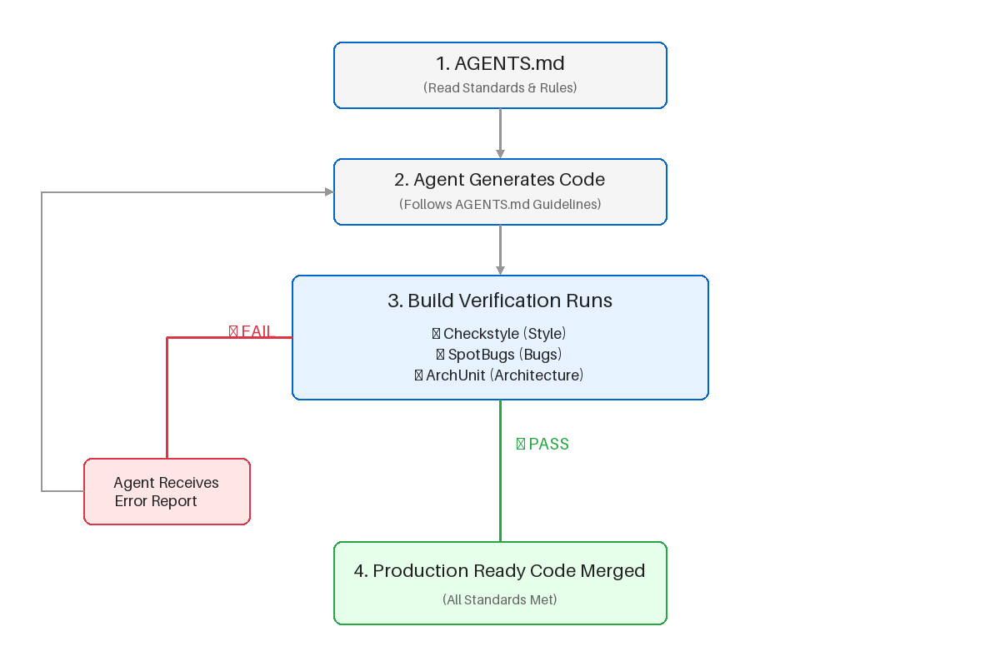

= Agent-Agnostic Guardrails: Universal Java Code Quality with AGENTS.md and Static Analysis

*JavaOne 2026* +
*Speaker:* Shuchita Prasad +
*Role:* Senior Lead Engineer, J P Morgan

<<<

== Agenda

. The Problem
. Context Engineering
. AGENTS.md and how to draft it
. Checkstyle - SpotBugs - ArchUnit
. Agent Feedback Loop using static analysis
. Live Demo
. Call to Action

<<<

== The Problem: Agent Inconsistency

[quote]
____
AI coding agents are powerful, but unpredictable.
____

*Challenges:*

* Different agents write code differently
* Each agent has different rule definitions
* No consistency across agent versions
* No accountability for code quality
* Prompt changes = different outputs

*Result:* Production code that's hard to review, maintain, and validate.

<<<

== The Solution: Agent-Agnostic Standards

[source,text]
----
+-----------------------------------------+
|         Coding Agent (Any)              |
|                                         |
+------------------+----------------------+
                   |
                   v
          +----------------+
          |   AGENTS.md    |  <- Source of Truth
          |   (Standards)  |
          +--------+-------+
                   |
                   v
        +----------------------+
        |  Production Code     |
        | (Consistent Quality) |
        +----------------------+
----

<<<

== Context Engineering for Coding Agents

[quote]
____
Curate what the AI sees to reduce guessing.
____

* Brief it like a new teammate
* Provide rules + constraints + examples
* Better context -> fewer surprises

*Key Insight:* +AGENTS.md+ is one piece of the puzzle.

<<<

== Context Window / What AI sees

image::./context_window.svg[Context window, width=95%]

<<<

== What You Control

* Prompt: task + constraints
* Standards: +AGENTS.md+ + style rules
* Context: architecture + examples
* Tools: build/test/lint feedback

*What you don't control:* model reasoning or perfectly repeatable output.

<<<

== What is AGENTS.md?

A *human-readable, machine-executable* format for defining coding standards.

*Key Characteristics:*

* Open, markdown-based format
* Works with any AI coding agent
* Readable by humans AND AI
* Enforceable by build systems

*Learn more:* https://agents.md/

<<<

== AGENTS.md Structure

[source,markdown]
----
# Project Overview

## Build and Test Commands

## Code Quality and Style

- Public methods must have JavaDoc comments
- No null pointer dereferences
- Follow resource-leak prevention patterns

## Architecture

- Dependency injection required
- No static initialization blocks
- Immutable objects for data transfer

## Security Consideration

- Ensure logs do not contain sensitive data / PII
- Validate all user inputs to prevent injection attacks (e.g., SQL injection, XSS)
----

<<<

== Why Static Analysis Tools?

[quote]
____
AGENTS.md defines standards. Static tools enforce them.
____

*The Gap:*

* Standards exist only in documentation
* Agents might miss subtle requirements
* Manual review is slow and subjective
* Violations slip into commits

*The Solution:*

* Automated, measurable quality metrics
* Manual review can focus on functional logic
* Prevents non-compliant code from merging

<<<

== Agile Agent Workflow

<<<

== Problem: Code Style Inconsistency

*Without Standards:*

* Inconsistent naming conventions
* Varying indentation and formatting
* Random brace placement
* Difficult code reviews

*Impact:* Maintenance nightmare, inconsistent codebase, low readability.

<<<

== Solution: Checkstyle

*What it does:*

* Enforces code style and formatting rules
* Validates naming conventions
* Checks indentation, whitespace, line length
* Runs in CI/CD pipeline

<<<

== Problem: Runtime and Security Bugs

*Without Standards:*

* Null pointer exceptions
* Resource leaks (unclosed streams)
* Type casting errors
* Integer overflow issues
* Concurrency problems

*Impact:* Production outages, security breaches.

<<<

== Solution: SpotBugs

*What it does:*

* Detects potential null pointer dereferences
* Finds resource leaks (files, connections)
* Identifies type mismatches
* Catches integer overflow/underflow
* Reports concurrency bugs

<<<

== Problem: Architectural Violations

*Without Standards:*

* Circular dependencies
* Layering violations
* Unwanted module interactions
* Business logic in wrong places
* Coupling between unrelated components

*Impact:* Unmaintainable systems, difficult refactoring.

<<<

== Solution: ArchUnit

*What it does:*

* Enforces architectural rules as tests
* Validates layer separation
* Prevents circular dependencies
* Controls access between modules
* Documents architecture in code

<<<

== AGENTS.md with Plugins Section

[source,markdown]
----
# Project Standards

## Code Quality Rules

- All public methods must have JavaDoc
- Maximum method length: 50 lines
- Cyclomatic complexity <= 10
- No null pointer dereferences
- Resources must be auto-closed

## Architectural Rules

- Controller -> Service -> Repository (layered)
- No circular dependencies
- Service layer exceptions must extend CustomException

## Plugins

Mandatory validation tools integrated with this AGENTS.md:

| Tool | Config | Purpose |
|------|--------|---------|
| Checkstyle | checkstyle.xml | Code style enforcement |
| SpotBugs | spotbugs.xml | Runtime bug detection |
| ArchUnit | ArchitectureTest.java | Architecture validation |

### Integration Instructions

1. Agent reads AGENTS.md as standard contract
2. Agent generates code accordingly
3. Build runs: `./mvnw verify`
4. If violations found, agent receives error report
5. Agent regenerates fixes and retries
----

<<<

== Agent Feedback Loop

*When Build Fails:*

[source,text]
----
Build Error Report:
- Checkstyle: Line 45 - Missing JavaDoc
- SpotBugs: Potential null pointer at line 78
- ArchUnit: Controller accessing repository directly
----

*Agent Actions:*

. Reads error report
. Reviews AGENTS.md rules
. Regenerates code with fixes
. Commit passes next build

<<<

== Key Benefits

*Agent Independence*

* Any coding agent produces consistent code
* Agents become replaceable

*Build Accountability*

* No code ships without passing standards
* Metrics are objective, not subjective

*Team Confidence*

* Code reviews become predictable
* Maintenance is easier

*Enterprise Ready*

* Regulatory compliance through enforcement
* Scalable to large teams

<<<

== Why This Matters

[quote]
____
Prompts are fragile. Standards are forever.
____

* Agents evolve quickly
* Teams grow
* Requirements change
* Production code must be stable

*Solution:* Define standards once, use with any agent.

<<<

== Live Demo Roadmap

. Generate code using prompt for a CRUD API (attempt 1)
. Observe the code with Checkstyle, SpotBugs, ArchUnit
. Write AGENTS.md with standards
. Generate code with agent (attempt 2)
. Build fails - violations detected
. Agent receives feedback
. Agent regenerates - build passes
. Compare code quality metrics

<<<

== Summary

[cols="1,3",options="header"]
|===
| Component | Purpose
| AGENTS.md | Human and machine-readable standard contract
| Checkstyle | Enforces code style consistency
| SpotBugs | Prevents runtime/security bugs
| ArchUnit | Maintains architectural integrity
|===

*Integration:* Standards + Tools + Feedback Loop = Production-Ready AI Code

<<<

== Call to Action

[quote]
____
Not: "How do I prompt better?"

But: "How do I enforce standards?"
____

* Standard-driven development
* Measurable quality
* Team scalability
* Enterprise adoption

<<<

== About the Author

[quote]
____
Download the sample AGENTS.md and recreate the project using prompts shared in README.md.
____

*Email:* shuchitatechtalks@gmail.com +
*LinkedIn:* https://www.linkedin.com/in/shuchita-prasad +
*GitHub:* https://github.com/ShuchitaTechTalks/agent-agnostic-guardrails

*Get the code, recreate the project, and join the conversation on building production-ready AI-generated code.*

<<<

== Thank You

*Questions?*

*Resources:*

* AGENTS.md: https://agents.md/
* Checkstyle: https://checkstyle.sourceforge.io/
* SpotBugs: https://spotbugs.readthedocs.io/
* ArchUnit: https://www.archunit.org/

*Let's make AI-generated code boring, predictable, and production-ready.*
