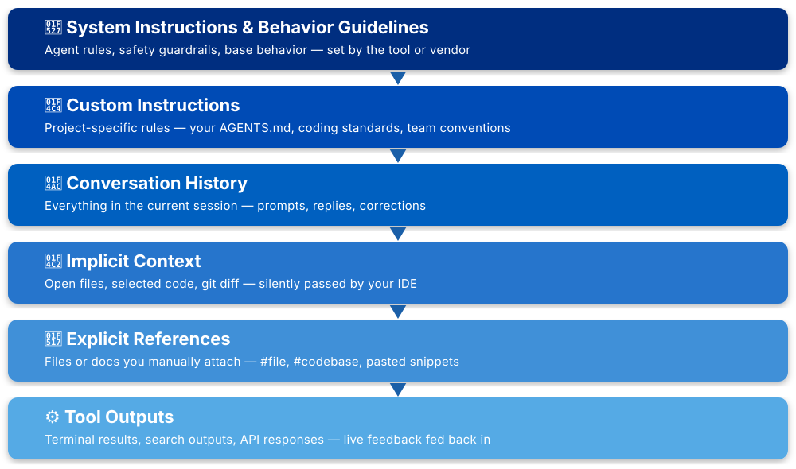
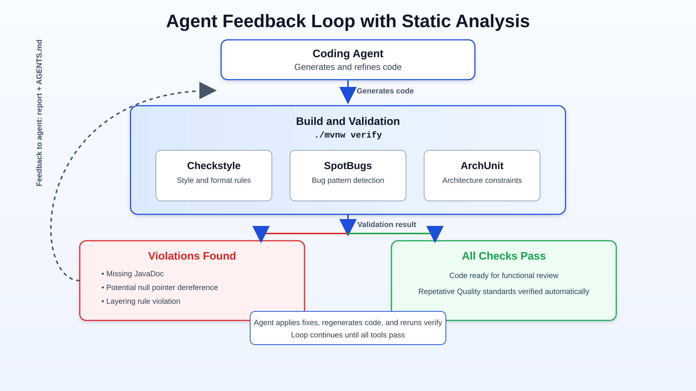

---
marp: true
size: 16:9
theme: default
paginate: true
transition: push
style: |
    section { background-color: #f0f4f8; color: #1a1a1a; }
    h1, h2, h3 { color: #0066cc; }
    code { background-color: #e8eef7; color: #000; font-size: 1.1em; }
    pre { font-family: 'Courier New', Courier, monospace; font-size: 1.10em !important; line-height: 1.4 !important; }
    blockquote { border-left: 4px solid #0066cc; color: #333; }
---

# 🤖 Agent-Agnostic Guardrails: Universal Java Code Quality with AGENTS.md and Static Analysis


**JavaOne 2026**  
**Speaker:** Shuchita Prasad 
**Role:** Senior Lead Engineer, J P Morgan 

---

## Agenda

1. 🚨 The Problem
2. 🧠 Context Engineering
3. 📄 AGENTS.md and how to draft it
4. 🔍 Checkstyle · SpotBugs · ArchUnit
5. 🔁 Agent Feedback Loop using static analysis
6. 🎬 Live Demo
7. ✅ Call to Action

---

## The Problem: Agent Inconsistency

> *AI coding agents are powerful, but unpredictable.*

**Challenges:**
- 🔄 Different agents write code differently
- 📝 Each agent has different rule definitions
- ⚠️ No consistency across agent versions
- 🚨 No accountability for code quality
- 🔀 Prompt changes = different outputs

**Result:** Production code that's hard to review, maintain, and validate.

---

## The Solution: Agent‑Agnostic Standards

```
┌─────────────────────────────────────────┐
│         Coding Agent (Any)              │
│                                         │
└──────────────┬──────────────────────────┘
               │
               ▼
        ┌────────────────┐
        │  AGENTS.md     │  ← Source of Truth
        │  (Standards)   │
        └─────┬──────────┘
              │
              ▼
    ┌──────────────────────┐
    │ Production Code      │
    │ (Consistent Quality) │
    └──────────────────────┘
```

---

## 🧠 Context Engineering for Coding Agents

<!-- _backgroundColor: #eef3fb -->

> **"Curate what the AI sees to reduce guessing."**

- Brief it like a new teammate
- Provide rules + constraints + examples
- Better context → fewer surprises

**Key Insight:** `AGENTS.md` is one piece of the puzzle.


---
## Context Window / What AI sees 



---

## What You Control

- Prompt: task + constraints
- Standards: `AGENTS.md` + style rules
- Context: architecture + examples
- Tools: build/test/lint feedback

**What you don’t control:** model reasoning or perfectly repeatable output.

---

## What is AGENTS.md?

A **human-readable, machine-executable** format for defining coding standards.

**Key Characteristics:**
- 📄 Open, markdown-based format
- 🤝 Works with any AI coding agent
- 👥 Readable by humans AND AI
- ✅ Enforceable by build systems


**Learn more:** https://agents.md/


---

## AGENTS.md Structure

```markdown
# Project Overview

## Build and Test Commands

## Code Quality and Style
- Public methods must have JavaDoc comments
- No null pointer dereferences
- Follow resource-leak prevention patterns

## Architecture
- Dependency injection required
- No static initialization blocks
- Immutable objects for data transfer

## Security Consideration
- Ensure logs do not contain sensitive data / PII
- Validate all user inputs to prevent injection attacks (e.g., SQL injection, XSS)
```

---

## How Agents Discover AGENTS.md

```
  Agent starts here
        |
        v
  project-root/              <- 1. Read first (global rules)
  +-- AGENTS.md  [ROOT]
  +-- src/
      +-- main/              <- 2. Read next (module rules)
      |   +-- AGENTS.md  [MODULE]
      |   +-- java/
      |       +-- com/myapp/service/    <- 3. Read last (nearest wins)
      |           +-- AGENTS.md  [LOCAL] <-- most specific, overrides parent
      |           +-- UserService.java  <-- file being generated
```

> Rules **merge top-down** — nearest `AGENTS.md` overrides parent on conflict

---

## Why Static Analysis Tools?

> **AGENTS.md defines standards. Static tools enforce them.**

**The Gap:**
- 📋 Standards exist only in documentation
- 🤖 Agents might miss subtle requirements
- 🔍 Manual review is slow and subjective
- 🚨 Violations slip into commits

**The Solution:**
- ✅ Automated, measurable quality metrics
- ✅ Manual review can focus on functional logic
- ✅ Prevents non-compliant code from merging


---

## Agent Feedback Loop




---

## Problem: Code Style Inconsistency

**Without Standards:**
- ❌ Inconsistent naming conventions
- ❌ Varying indentation and formatting
- ❌ Random brace placement
- ❌ Difficult code reviews

**Impact:** Maintenance nightmare, inconsistent codebase, Low Readability

---

## Solution: Checkstyle

**What it does:**
- ✅ Enforces code style & formatting rules
- ✅ Validates naming conventions
- ✅ Checks indentation, whitespace, line length
- ✅ Runs in CI/CD pipeline


---

## Problem: Runtime & Security Bugs

**Without Standards:**
- ❌ Null pointer exceptions
- ❌ Resource leaks (unclosed streams)
- ❌ Type casting errors
- ❌ Integer overflow issues
- ❌ Concurrency problems

**Impact:** Production outages, security breaches

---

## Solution: SpotBugs

**What it does:**
- ✅ Detects potential null pointer dereferences
- ✅ Finds resource leaks (files, connections)
- ✅ Identifies type mismatches
- ✅ Catches integer overflow/underflow
- ✅ Reports concurrency bugs


---

## Problem: Architectural Violations

**Without Standards:**
- ❌ Circular dependencies
- ❌ Layering violations
- ❌ Unwanted module interactions
- ❌ Business logic in wrong places
- ❌ Coupling between unrelated components

**Impact:** Unmaintainable systems, difficult refactoring

---

## Solution: ArchUnit

**What it does:**
- ✅ Enforces architectural rules as tests
- ✅ Validates layer separation
- ✅ Prevents circular dependencies
- ✅ Controls access between modules
- ✅ Documents architecture in code

---

## AGENTS.md — Plugins Section

```markdown
## Plugins

Mandatory validation tools integrated with this AGENTS.md:

| Tool       | Config                  | Purpose                   |
|------------|-------------------------|---------------------------|
| Checkstyle | checkstyle.xml          | Code style enforcement    |
| SpotBugs   | spotbugs.xml            | Runtime bug detection     |
| ArchUnit   | ArchitectureTest.java   | Architecture validation   |

## Integration Instructions
1. Agent reads AGENTS.md as standard contract
2. Agent generates code accordingly
3. Build runs: ./mvnw verify
4. If violations found → agent receives error report
5. Agent regenerates fixes and retries
```


---

## Key Benefits

✅ **Agent Independence**
- Any coding agent produces consistent code
- Agents become replaceable

✅ **Build Accountability**
- No code ships without passing standards
- Metrics are objective, not subjective

✅ **Team Confidence**
- Code reviews become predictable
- Maintenance is easier

✅ **Enterprise Ready**
- Regulatory compliance through enforcement
- Scalable to large teams

---

## Why This Matters

> **Prompts are fragile. Standards are forever.**

- 🚀 Agents evolve quickly
- 📈 Teams grow
- 🔄 Requirements change
- 💼 Production code must be stable

**Solution:** Define standards once, use with any agent.

---

## Live Demo Roadmap

1. 🤖 Display code generated using prompt for a crud API without Checkstyle, SpotBugs, ArchUnit or AGENTS.md file. 
2. 🔍 Observe the code quality 
3. ✍️ Now Write AGENTS.md with standards
4. 🤖 Generate code with AGENTS.md file and Checkstyle, SpotBugs, ArchUnit.
5. 🔧 Agent receives reads the plugin and AGENTS.md files.
6. ✅ Agent generatescode.
7. 📊 Compare code quality metrics

---

## Summary

| Component | Purpose |
|-----------|---------|
| **AGENTS.md** | Human & machine-readable standard contract |
| **Checkstyle** | Enforces code style consistency |
| **SpotBugs** | Prevents runtime/security bugs |
| **ArchUnit** | Maintains architectural integrity |

**Integration:** Standards + Tools + Feedback Loop = Ready for Functional Review

---

## Call to Action

> **Not:** "How do I prompt better?"  
> **But:** "How do I enforce standards?"

- 🎯 Standard-driven development
- 🔒 Measurable quality
- 👥 Team scalability
- 🏢 Enterprise adoption


---

## About the Author

> **Download the sample AGENTS.md and recreate the project using prompts shared in README.md!**

📧 **Email:** shuchitatechtalks@gmail.com
🔗 **LinkedIn:** https://www.linkedin.com/in/shuchita-prasad
💻 **GitHub:** https://github.com/ShuchitaTechTalks/agent-agnostic-guardrails

**Get the code, recreate the project, and join the conversation .**

---

## Thank You

**Questions?**

**Resources:**
- AGENTS.md: https://agents.md/
- Checkstyle: https://checkstyle.sourceforge.io/
- SpotBugs: https://spotbugs.readthedocs.io/
- ArchUnit: https://www.archunit.org/

**Let's make AI-generated code boring, predictable, and better quality.**

